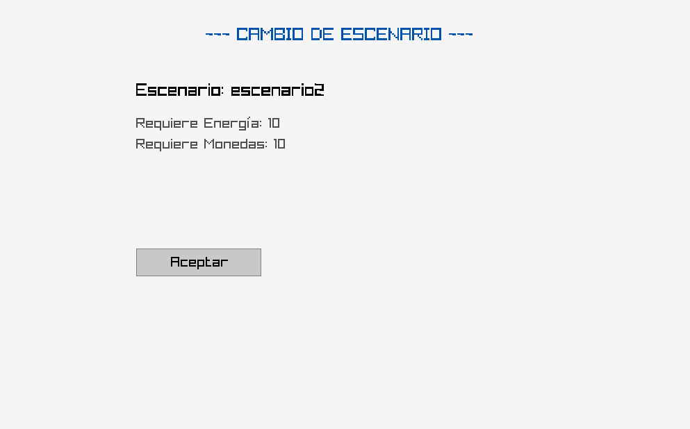

======================================================================

                            PetPocket

======================================================================

▶Descripción

◜                                                                                                         ◝
 PetPocket es una  aplicación que consiste en una mascota virtual llamada Pocket con la cual puedes interactuar con diferentes botones 
 donde podrás: avanzar por distintos escenarios, comprar comida, comprar aspectos y divertirte con un juego ritmico. 
◟                                                                                                         ◞

▶Cómo compilar y ejecutar el programa

◜                                                                                                                       ◝
 Este aplicación fue desarrollada en el lenguaje C, usando la biblioteca Raylib. Para ejecutar el programa esto se debe hacer mediente el  programa **Visual Studio Code**, junto con sus respectivas extensiones como C/C++ Extensión Pack* de Microsoft. Para compilar y ejecutar, los pasos son los siguientes:

 ●Requisitos previos:
  
  ○ Tener instalado Visual Studio Code.
  ○ Instalar la extensión C/C++ (Microsoft) en visual Studio code.
  ○ Tener instalado un compilador de C por ejemplo gcc.
    Si se utiliza windows para ejecutar este programa
    se recomienda instalar MinGW o utilizar el entorno WSL.
  ○ Descargar biblioteca raylib e incluirla al *PATH*, se puede descargar en el siguiente link: https://raysan5.itch.io/raylib/download/eyJleHBpcmVzIjoxNzUxMDYwNjIzLCJpZCI6ODUzMzF9.sM3tnZIwvcesnmFXoGpKTbgjcOE%3d
  ○ Instalar en VScode las etensiones *CMake* y *Autocomplete for raylib-lua-bindings*

 ●Pasos para compilar y ejecutar:

  ▷ Entrar al repositorio de github de PetPocket, luego debe clonar o descargar el repositorio.

  ▷ Abrir la aplicación en Visual Studio Code
   ○ Inicia Visual Sudio Code.
   ○ Selecciona [Archivo > Abrir carpeta -> (nombre de la carpeta con el repositorio)].

  ▷ Compilar el código: hay dos formas de compilar el codigo
    Forma 1:
    ○ Dentro de la carpeta main.c presionando "F5" dentro de la terminar de powershell.
    Forma 2:
    ○ Iniciando el programa desde el main.exe directamente desde la carpeta.
◟                                                                                                                       ◞

▶Funcionalidades

◜                                                                                                                                ◝
 ●Funcionando Correctamente:
  ○ La creacion de la mascota inicializando: su energia al 100% y sus monedas en cero, además su inventario se inicializa vacío.
  ○ Alimentar a la mascota, esta opción muestra la comida (tipo y cantidad) en el inventario.
  ○ Juego ritmico, permite jugar un juego rítmico en el cual se le otroga monedas a su mascota a partir del puntaje obtenido, además la mascota pierde energía al jugar.
  ○ Avanzar de escenario, siempre y cuando se cuente con energía mayor a 50 y se cumplan los requisitos en comida y energía.
  ○ Enseña la tienda con los aspectos y comidas disponibles para adquirir por un precio en monedas.
  ○ Las opciones del sistema donde puedes cambiar el nombre, ajustes de volumen, reiniciar la partida y salir de la aplicacion.

 ●Limitaciones conocidas:
  ○ Si se carga un archivo csv con más de 7 escenarios existe la posibilidad de crear un glitch.
 
 ●A mejorar:
  ○ Aún no se implementan items desbloqueables a partir del escenario en que se encuentre la mascota.
◟                                                                                                                                ◞

▶Ejemplo de uso:
Los pasos son solo en modo de ejemplo, el usaruio podra escojer cualquier boton una vez se encuentre en la interfaz principal.
◜                                                                                                                                       ◝
 ● Pantalla de inicial
 Se mostrará una ventana emergente la cual te pedirá que le pongas un nombre a tu PET.
 ◤                                                             ◥
  
 ◣                                                             ◢
 □ Una vez tu PET tenga su nombre, el porgrama te llevará al interfaz principal.

 ● Interfaz principal
 Se mostrará una interfaz con tu mascota, la cual te mostrará: su nombre, su energía y sus monedas. Además la interfaz cuenta con diversos botones interactivos. Para salir de los botnes seleccionados el usuario debe presionar en su teclado la tecla "Back space". Los botones cuentan con imágenes para que el usuario pueda intuir en que consiste cada botón. Los botones consisten en 6, que se ordenan de la siguiente manera: En la esquina izquierda encontramos los botones para acceder a la tienda y para alimentar a la mascota respectivamente, en el centro encontramos el botón para jugar al minijuega, a la derecha encontramos los botones para acceder a las opciones, cambiar aspectos y avanzar de escenario respectivamente.
 ◤                                                                  ◥
  
 ◣                                                                  ◢
 □ El usuario es libre de presionar el boton que considere necesario para interactuar con el programa. 

 ● Opciones del sistema
 Al seleccionar el boton opciones saldra una venta en la cual el usauraio podrá: cambiar el nombre de su macota, ajustar el volumen del juego, reiniciar la partida y salir del juego. 
 ◤                                                                                ◥
  
 ◣                                                                                ◢
 □ Al reiniciar la partida, te llevara a la pantalla de inicio y se reiniciarán los parámetros a los predeterminados.

 ● Tienda
 Al seleccionar el boton de la tienda de aspectos, la plicación mostrará un catálogo de distintos aspectos, donde cada uno tiene un costo en monedas. Además en el caso de ser comida se mostrará la cantidad de ese tipo de comida que el usuario haya comprado, esta misma se añadirá al inventario una vez comprada.
 ◤                                                                  ◥
  
 ◣                                                                  ◢
 □ Para seleccionar el ítem que se desea comprar, el usuario debe hacer click izquierdo sobre la opción. La tienda se encuentra ordenada por el precio de los ítems de menor a mayor. Si el usuario no cuenta con monedas suficientes se le informará con un mensaje y no podrá adquirir el ítem.

● Alimentar Mascota
 Al seleccionar el boton para alimentar a la mascota, se mostrará una ventana con un catálogo que consiste en todos los tipos de comida (con la energía que aportan al consumirlas) y sus cantidades con las que cuenta la mascota en su inventario.
 ◤                                                      ◥
  
 ◣                                                      ◢
 □ Para consumir el alimento el usuario deberá navegar por los tipos de comida que se encuentran en el inventario de la mascota con las flechas izquiera y derecha  de su teclado (<- y ->), una vez se encuentre seleccionando la opción requerida debe presionar la tecla "Enter" y se realizará la operación. Una vez consumido el alimento se aumentará respectivamente la energía de la mascota y se eliminará la/las comidas del inventario dependiendo de la operación seleccionada por el usuario. Si la energía se encuentra al máximo (100) se mostrará un mensaje en pantalla indicando que no se puede realizar la operación debido a que la energía ya se encuentra en el máximo.

● Aspectos
 Al seleccionar el boton para cambiar el aspecto de la mascota, se mostará una ventana con un catálogo con todos los aspectos adquiridos por el usuario (estos son los aspectos comprados que se encuentran en el inventario de la mascota).
 ◤                                                      ◥
  
 ◣                                                      ◢
 □ Para cambiar el aspecto el usuario deberá navegar por los diferentes aspectos que se encuentran en el inventario de la mascota con las flechas izquiera y derecha  de su teclado (<- y ->), una vez se encuentre seleccionando la opción requerida debe presionar la tecla "Enter" y se realizará la operación.

● Cambiar Escenario
 Al seleccionar el boton para cambiar de escenario se mostrará un mensaje en pantalla informando que la operación se realizó con éxito, descontando las monedas y energía que se requieren para el cambio. En el caso que no se cumplan los requerimientos de monedas y/o energía se mostrará un mensaje indicando que la acción no se puede realizar.
 ◤                                                      ◥
  
 ◣                                                      ◢
 □ Una vez realizado el cambio de escenario, el fondo de la mascota cambiará.

▶Contribuciones

◜                                                                                                                                ◝
 ●Benjamín Iribarren
  ○ Carga de datos
  ○ Funcionamiento de tienda
  ○ Funcionalidad para cambio de aspecto
  ○ Funcionalidad para crear Mascota
  ○ Funcionalidad para alimentar Mascota
  ○ Diseño y redacción del README

 ●Felipe Iribarra
  ○ Interfaz
  ○ Juego rítmico
  ○ Menú principal
  ○ Botones
  ○ Funcionalidad para cambio de escenario
  ○ Funcionalidad para configuraciones
  ○ Funcionalidad para crear Mascota
  ○ Funcionalidad para alimentar Mascota
  ○ Revisiones

 ●Jorge Plaza
  ○ TDAs
  ○ Investigación
  ○ Propuestas
  ○ Diseño y redacción del README
◟                                                                                                                                ◞

 